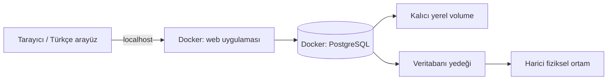

# GürBoya — Yerel web mimarisi

Durum: Yerel web + PostgreSQL + Docker kullanıcı tarafından onaylandı. Framework'ler henüz seçilmedi. Aşağıdaki teknik ayrıntılar tasarım önerisidir; uygulama ve kurulum yapılmadı.

## Çalışma düzeni

Mac ve Windows birbirinden bağımsız yerel kurulumlardır. Mac'te test verisi, Windows'ta işletme verisi bulunur; otomatik senkronizasyon yapılmaz. Windows için desteklenen işletim sistemi, sanallaştırma ve Docker Desktop/WSL 2 gereksinimleri kontrol edilir. Docker'ın açılışta başlaması ve ardından servislerin başlatılması ayrıca doğrulanır; yalnızca restart policy yazmak işletim sistemi açılışını garanti etmez.

Docker Compose aynı servis tanımını kullanır. PostgreSQL imajı ve ileride uygulama imajı ARM64/AMD64 desteklemeli; linux/amd64 zorlanmamalıdır. Sabit desteklenen sürüm seçilir, latest kullanılmaz. Veritabanı volume yolu seçilen PostgreSQL imajının sürümüne göre resmî dokümandan doğrulanır. Volume kalıcıdır fakat yedek değildir.

Hosta yayımlanan uygulama portu 127.0.0.1'e bağlanır. Uygulama konteyner içinde diğer gerekli konteyner bağlantılarına uygun arayüzde dinler; host loopback kısıtı port eşlemesinde uygulanır. Veritabanı normalde hosta açılmaz; geliştirmede gerekirse yalnızca localhost'a bağlanır. Tarayıcı PostgreSQL'e doğrudan erişmez. Uygulama ayrı, asgari yetkili DB hesabı kullanır; migration ve yönetim yetkileri ayrılır.

## Stack ve modüller

Frontend/backend henüz onaylanmadı. Aday React + TypeScript ve ASP.NET Core; daha sade sunucu taraflı arayüz de karşılaştırılabilir. İlk altyapı işi bu seçimlerden bağımsızdır. Framework ve ORM onayı F1-B'nin ön koşuludur; bu belgeler React veya .NET seçilmiş anlamına gelmez.

Öneri modüler monolit: katalog, stok, satış ve raporlama ayrı sorumluluklar; tek dağıtılabilir uygulama. Mikroservis, mesaj kuyruğu, Redis, Kubernetes veya çok cihazlı offline senkronizasyon gereksinimi yoktur. İlk kurulum tek işletmedir; SaaS/çok şube ileride ayrı tasarım ve migration gerektirir. Henüz tenant izolasyonu mevcut değildir.

## İnternetsiz kullanım

Arayüz, ikon, yazı tipi ve bağımlılıklar dağıtıma dahil edilir. CDN, bulut giriş servisi veya lisans sunucusu günlük kullanım için zorunlu olmaz. Önceden indirilen imajlar ile servisler internetsiz yeniden başlatılabilmelidir. İlk indirme/güncelleme internet ya da hazırlanmış çevrimdışı paket gerektirir. Tarayıcı depolaması işletme verisinin asıl kaynağı değildir.

Veritabanı kapalıyken veya kayıt sonucu belirsizken başarılı işlem gösterilmez; Türkçe durum ve yeniden deneme sunulur. Aynı işlem kimliği tekrar kullanılarak çift kayıt önlenir. Bilgisayar/elektrik arızasında uygulama durur; UPS ihtiyacı ve kurtarma hedefleri canlıya geçiş öncesi değerlendirilir.

## Ürün akışı ve arayüz

Ürün adı, marka (elle eklenebilir/seçilebilir), kategori, boya için ambalaj hacmi (litre), stok birimi, alış/satış fiyatı ve isteğe bağlı barkod girilir. Stok girişi ayrıca miktar ve açıklama içerir. Boyada fiyat TL/kutu, miktar kutu sayısıdır; litre hacim bilgisidir. Diğer ürünler adet veya gram üzerinden izlenebilir. Gram/litre otomatik dönüşümü yapılmaz.

Örnek: 2,5 L ambalajdan 12 kutu = 30 L toplam hacim; 1 kutu satış sonrası 11 kutu kalır. 15 L ambalaj ayrı stok kalemi önerisidir. Marka/seri/baz bilgisi farklı ürünleri ayırt eder. Aynı ürünün tekrar gelişi yeni ürün kartı yerine stok hareketi oluşturur.

Renk kodu satış satırına kaydedilir; pigment tüketimi ve reçete modülü yapılmaz. Hazır renkli ürün/baz türlerinin stok kimliğine etkisi ve renklendirme ücreti açık sorudur. Stok birimi işlem geçmişi oluştuktan sonra doğrudan değiştirilemez.

Büyük ve okunabilir alanlar, klavyeyle geçiş, hızlı ürün arama, Türkçe hata mesajları ve yanlış işlem için açıklamalı düzeltme esastır. Her işlem için modal açılmaz; iptal ve kritik stok düzeltmesinde açık onay/gerekçe alınır. Türkçe ondalık virgül desteklenir; fiyatın kutu/adet/gram başına olduğu alan yanında belirtilir. Barkod donanımı henüz doğrulanmadı; varsa klavye gibi çalışan okuyucuyla test edilir.

## Bütünlük, güvenlik ve yedek

Satış, stok hareketi, stok bakiyesi ve gerekli audit kaydı tek transaction'da işlenir. Fiyat değişikliği geçmiş satış fiyatını değiştirmez. İade/iptal önceki işlemi silmez; ters kayıt oluşturur. Ayrıntılar [database.md](database.md) içindedir.

Parametreli sorgu/ORM, sunucu tarafı doğrulama, güvenilir kimlik kütüphanesi ve güvenli parola özeti kullanılır; özel şifreleme veya kimlik sistemi yazılmaz. Roller henüz belirlenmedi. Cookie tabanlı oturum seçilirse CSRF koruması, güvenli oturum ayarları ve CORS/origin kısıtları tasarlanır. SQL şifreleri, müşteri bilgileri ve hassas içerik loglara yazılmaz. Yalnızca localhost kullanımı güvenliğin yerine geçmez.

Öneri pg_dump ile günlük yedek, pg_restore ile ayrı veritabanında geri yükleme provası ve harici ortama kopyadır. PostgreSQL rolleri/kurulum sırları dump dışında ayrıca güvenli yönetilir. Aynı disk yedeği disk arızasına karşı yeterli değildir. Günlük yedek gün içindeki tüm işlemleri korumaz; kabul edilen veri kaybı/saklama süresi henüz belirlenmedi. Canlı verinin üstüne prova yapılmaz.

Resmî muhasebe, ödeme cihazı, e-fatura/e-arşiv entegrasyonu varsayılmaz. Böyle özellikler istenirse güncel mevzuat ve entegrasyon gereksinimleri ayrıca doğrulanır. Kişisel veri toplamayı gerektiren müşteri/cari modülü öncesinde saklama, erişim ve silme gereksinimleri netleştirilir.

## Kaynaklar

8 Ekim 2026 kontrolü: [PostgreSQL Docker imajı](https://hub.docker.com/_/postgres), [Docker Windows gereksinimleri](https://docs.docker.com/desktop/setup/install/windows-install/), [PostgreSQL yedekleme](https://www.postgresql.org/docs/current/backup-dump.html). Eski MSSQL kararı [karar kaydında](decisions.md) tarihsel olarak korunur.
