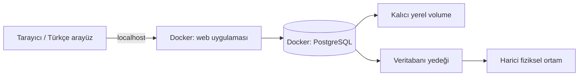

# GürBoya — Yerel web mimarisi

Durum: Yerel web + PostgreSQL + Docker kullanıcı tarafından onaylandı. Razor Pages + EF Core + Npgsql kullanıcı tarafından onaylandı. F2 ürün/stok ve tek yönetici girişi uygulandı; F3 satış/iade de uygulandı.

## Çalışma düzeni

Mac ve Windows birbirinden bağımsız yerel kurulumlardır. Mac'te test verisi, Windows'ta işletme verisi bulunur; otomatik senkronizasyon yapılmaz. Windows için desteklenen işletim sistemi, sanallaştırma ve Docker Desktop/WSL 2 gereksinimleri kontrol edilir. Docker'ın açılışta başlaması ve ardından servislerin başlatılması ayrıca doğrulanır; yalnızca restart policy yazmak işletim sistemi açılışını garanti etmez.

Docker Compose aynı servis tanımını kullanır. PostgreSQL imajı ve ileride uygulama imajı ARM64/AMD64 desteklemeli; linux/amd64 zorlanmamalıdır. Sabit desteklenen sürüm seçilir, latest kullanılmaz. Veritabanı volume yolu seçilen PostgreSQL imajının sürümüne göre resmî dokümandan doğrulanır. Volume kalıcıdır fakat yedek değildir.

Hosta yayımlanan uygulama portu 127.0.0.1'e bağlanır. Uygulama konteyner içinde diğer gerekli konteyner bağlantılarına uygun arayüzde dinler; host loopback kısıtı port eşlemesinde uygulanır. Veritabanı normalde hosta açılmaz; geliştirmede gerekirse yalnızca localhost'a bağlanır. Tarayıcı PostgreSQL'e doğrudan erişmez. Uygulama ayrı, asgari yetkili DB hesabı kullanır; migration ve yönetim yetkileri ayrılır.

## F1-A uygulanan altyapı — 8 Ekim 2026

compose.yaml yalnızca db servisini içerir. PostgreSQL 18.6-bookworm, değişmez çok mimarili index digest sha256:afc7e2d441324c0388fa80c3d24f733b4194a4eb7f47dd8ee2b08eb1a24a647c ile sabitlendi. Desteklenen PostgreSQL 18 serisi ve Debian varyantı seçildi; beta/latest kullanılmadı. Registry manifestinde linux/amd64 ve linux/arm64/v8 doğrulandı. Yerel çalışma ARM64 üzerinde test edildi; AMD64/Windows çalışma testi yapılmadı.

[Resmî imajın PGDATA açıklamasına](https://github.com/docker-library/docs/blob/master/postgres/README.md#pgdata) göre PostgreSQL 18 için named volume /var/lib/postgresql üzerine bağlanır; PGDATA varsayılanı /var/lib/postgresql/18/docker kalır. Sürüm desteği [PostgreSQL sürüm politikasından](https://www.postgresql.org/support/versioning/) kontrol edildi. Digest değişikliği ve major yükseltme ayrı bakım işidir.

Host port eşlemesi yoktur; database ağı internal: true'dur. Parola .env üzerinden zorunludur ve örnek dosyada boştur. SCRAM host kimlik doğrulaması, pg_isready healthcheck, unless-stopped yeniden başlatma ve 128 MB paylaşımlı bellek tanımlıdır. Healthcheck hazır olmayı sınar; gerçek parola/TCP bağlantısı ayrıca kabul testinde sınanır. Başlangıç yönetim hesabı superuser'dır; F1-B uygulaması için bu hesabın kullanılması uygun değildir. İş tabloları ve otomatik init/migration scriptleri eklenmedi.

scripts/test-postgres.sh benzersiz test projesinde çalışır; ana kurulumdan ayrı volume kullanır. Test çıkışında konteyner/ağ kaldırılır, volume korunur. Yedek/geri yükleme ve işletim komutları [README](README.md), doğrulama kanıtları [ilerleme](progress.md) içindedir.

## Stack ve modüller

ASP.NET Core Razor Pages + EF Core + Npgsql kullanıcı tarafından onaylandı. Tek src/GurBoya.Web projesinde sunucu tarafında HTML üretilir; tarayıcı DB'ye erişmez. Pages HTTP/sunum katmanı, Data DB erişimi ve migration sorumluluğudur. İş servisleri ilgili fazda eklenecek; genel repository, SPA veya ayrı API dağıtımı eklenmedi.

GET /health/live süreç canlılığını; GET /health/ready DB bağlantısını ve uygulanmamış migration bulunmadığını kontrol eder. Hazır değilse 503 ve sabit Türkçe mesaj döner. Ana sayfa aynı durumu gösterir ve yeniden deneme bağlantısı sunar. Yanıtta DB parolası/bağlantı metni/SQL ayrıntıları verilmez. 404 ve beklenmeyen hata sayfaları Türkçedir. F2 ürün/stok sayfaları Identity oturumu gerektirir; tüm form POST işlemleri antiforgery doğrulamasından geçer. Ana durum sayfası ve health uçları yalnızca genel sistem durumunu anonim gösterir.

compose.app.yaml temel Compose dosyasına eklenir: web sadece 127.0.0.1:5080 üzerinden yayımlanır, konteynerde 8080 dinler ve root olmayan .NET kullanıcısıyla çalışır. DB iç ağda kalır. Araç profilindeki db-setup yönetim hesabıyla rol/şema yetkilerini hazırlar; migrate ayrı DDL hesabıyla açıkça çalıştırılır. Web sadece gurboya_app parolasını alır. Açılışta otomatik migration/EnsureCreated/reset yoktur. app şeması iş tabloları için ayrılmıştır; infrastructure şeması migration geçmişini tutar. Başlangıç migration'ı kasıtlı olarak iş tablosu oluşturmaz.

SDK 10.0.401 ve ASP.NET Core 10.0.9 imajları çok mimarili digest ile sabitlendi; registry'de ARM64 ve AMD64 desteği doğrulandı. EF Core/araç 10.0.9, Npgsql sağlayıcısı 10.0.3; NuGet lock dosyası sürümlenir. Hosttaki eski SDK'nın yükseltilmesi gerekmeden konteyner SDK kullanılabilir. Kaynaklar: [Razor Pages + EF Core](https://learn.microsoft.com/en-us/aspnet/core/data/ef-rp/intro?view=aspnetcore-10.0), [Npgsql](https://www.npgsql.org/efcore/), [EF migration uygulama](https://learn.microsoft.com/en-us/ef/core/managing-schemas/migrations/applying).

Öneri modüler monolit: katalog, stok, satış ve raporlama ayrı sorumluluklar; tek dağıtılabilir uygulama. Mikroservis, mesaj kuyruğu, Redis, Kubernetes veya çok cihazlı offline senkronizasyon gereksinimi yoktur. İlk kurulum tek işletmedir; SaaS/çok şube ileride ayrı tasarım ve migration gerektirir. Henüz tenant izolasyonu mevcut değildir.

## İnternetsiz kullanım

Arayüz, ikon, yazı tipi ve bağımlılıklar dağıtıma dahil edilir. CDN, bulut giriş servisi veya lisans sunucusu günlük kullanım için zorunlu olmaz. Önceden indirilen imajlar ile servisler internetsiz yeniden başlatılabilmelidir. İlk indirme/güncelleme internet ya da hazırlanmış çevrimdışı paket gerektirir. Tarayıcı depolaması işletme verisinin asıl kaynağı değildir.

Veritabanı kapalıyken veya kayıt sonucu belirsizken başarılı işlem gösterilmez; Türkçe durum ve yeniden deneme sunulur. Aynı işlem kimliği tekrar kullanılarak çift kayıt önlenir. Bilgisayar/elektrik arızasında uygulama durur; UPS ihtiyacı ve kurtarma hedefleri canlıya geçiş öncesi değerlendirilir.

## Ürün akışı ve arayüz

Ürün adı, marka (elle eklenebilir/seçilebilir), kategori, boya için ambalaj hacmi (litre), stok birimi, alış/satış fiyatı ve isteğe bağlı barkod girilir. Stok girişi ayrıca miktar ve açıklama içerir. Boyada fiyat TL/kutu, miktar kutu sayısıdır; litre hacim bilgisidir. Diğer ürünler kutu, adet veya gram üzerinden izlenebilir; tüm miktarlar tam sayıdır. Gram/litre otomatik dönüşümü yapılmaz.

Örnek: 2,5 L ambalajdan 12 kutu = 30 L toplam hacim; 1 kutu satış sonrası 11 kutu kalır. 15 L ambalaj ayrı stok kalemi önerisidir. Marka/seri/baz bilgisi farklı ürünleri ayırt eder. Aynı ürünün tekrar gelişi yeni ürün kartı yerine stok hareketi oluşturur.

Renk kodu satış satırına kaydedilir; pigment tüketimi ve reçete modülü yapılmaz. Hazır renkli ürün/baz türlerinin stok kimliğine etkisi ve renklendirme ücreti açık sorudur. Stok birimi işlem geçmişi oluştuktan sonra doğrudan değiştirilemez.

Büyük ve okunabilir alanlar, klavyeyle geçiş, hızlı ürün arama, Türkçe hata mesajları ve yanlış işlem için açıklamalı düzeltme esastır. Her işlem için modal açılmaz; iptal ve kritik stok düzeltmesinde açık onay/gerekçe alınır. Türkçe ondalık virgül desteklenir; fiyatın kutu/adet/gram başına olduğu alan yanında belirtilir. Barkod donanımı henüz doğrulanmadı; varsa klavye gibi çalışan okuyucuyla test edilir.

## Bütünlük, güvenlik ve yedek

Satış, stok hareketi, stok bakiyesi ve gerekli audit kaydı tek transaction'da işlenir. Fiyat değişikliği geçmiş satış fiyatını değiştirmez. İade/iptal önceki işlemi silmez; ters kayıt oluşturur. Ayrıntılar [database.md](database.md) içindedir.

Parametreli sorgu/ORM, sunucu tarafı doğrulama, güvenilir kimlik kütüphanesi ve güvenli parola özeti kullanılır; özel şifreleme veya kimlik sistemi yazılmaz. Tek yonetici hesabı seçildi; kullanıcıya açık kayıt/rol yönetimi yoktur. Cookie tabanlı oturum seçilirse CSRF koruması, güvenli oturum ayarları ve CORS/origin kısıtları tasarlanır. SQL şifreleri, müşteri bilgileri ve hassas içerik loglara yazılmaz. Yalnızca localhost kullanımı güvenliğin yerine geçmez.

Öneri pg_dump ile günlük yedek, pg_restore ile ayrı veritabanında geri yükleme provası ve harici ortama kopyadır. PostgreSQL rolleri/kurulum sırları dump dışında ayrıca güvenli yönetilir. Aynı disk yedeği disk arızasına karşı yeterli değildir. Günlük yedek gün içindeki tüm işlemleri korumaz; kabul edilen veri kaybı/saklama süresi henüz belirlenmedi. Canlı verinin üstüne prova yapılmaz.

Resmî muhasebe, ödeme cihazı, e-fatura/e-arşiv entegrasyonu varsayılmaz. Böyle özellikler istenirse güncel mevzuat ve entegrasyon gereksinimleri ayrıca doğrulanır. Kişisel veri toplamayı gerektiren müşteri/cari modülü öncesinde saklama, erişim ve silme gereksinimleri netleştirilir.

## Kaynaklar

8 Ekim 2026 kontrolü: [PostgreSQL Docker imajı](https://hub.docker.com/_/postgres), [Docker Windows gereksinimleri](https://docs.docker.com/desktop/setup/install/windows-install/), [PostgreSQL yedekleme](https://www.postgresql.org/docs/current/backup-dump.html). Eski MSSQL kararı [karar kaydında](decisions.md) tarihsel olarak korunur.

## F2 iş katmanı ve güvenlik

InventoryService ürün, fiyat ve stok transaction'larının ortak yazma yoludur; EF Core DbContext IdentityUserContext üzerinden standart kimlik tablolarını da yönetir. Ürün üzerindeki bigint version eski formu yakalar. İstek UUID'si+hash transaction advisory lock altında denetlenir; stok için ürün satırı kilitlenir. DB hareket trigger'ı bakiye ile hareketi atomik günceller ve eksi stok engelini uygular. Geçmiş tabloları append-only; detaylar database.md'de.

ASP.NET Identity'nin PasswordHasher/UserManager/SignInManager bileşenleri kullanılır; özel parola kriptografisi yazılmadı. Giriş sadece tek yönetici şifresiyle yapılır, dış kayıt yoktur. HttpOnly/SameSite=Strict oturum çerezi, 8 saat kayan süre ve 5 hatada 5 dakika kilitleme vardır. Kullanıcı şifresini değiştirebilir; güvenlik damgası 1 dakikada kontrol edilir. Yerel HTTP sadece loopback'e açıktır; dış ağ dağıtımı bu kurulumun kapsamı değildir.

Anahtarlar uygulama kullanıcısına ait 0700 /keys dizinindeki named volume'da kalıcıdır; konteyner yeniden oluşturulması oturumu bozmaz. Anahtar XML'leri bu yerel dağıtımda ayrıca şifrelenmez; disk/OS hesabı erişimi Windows pilotunda doğrulanacak. İlk parola yalnızca admin bakım hizmetine verilir; web DB yönetim/migration/ilk-parola sırlarını almaz. İlk kurulum dosyaları Git dışında kalır.

KDV hesabı yalnızca sunucuda decimal ile yapılır; fiyat önizlemesi normal CSRF korumalı form gönderimidir, tarayıcıda ayrı float hesap uygulanmaz. CSS yereldir; üçüncü taraf CDN, script veya yazı tipi yoktur.

## F3 satış katmanı

SalesService, SalePricing ve Pages/Sales eklendi; ek bağımlılık yok. Sunucu hesaplı form sepeti kalıcı taslak değildir ve stok ayırmaz. Ödeme alındı düğmesi nakit/kart bilgisiyle değişmez satış oluşturur. KDV dahil renklendirme tutarı satır içindedir, aynı boya oranına tabidir; ürün kartını değiştirmez. Fiş fiyatı dört basamaklı ürün girdisinden yüksek hassasiyetle hesaplanır; satış/iadede net/KDV/toplam kuruşla saklanır.

Satış UUID/hash kilidi, ürün kimliği sıralı satır kilitleri, sürüm/stok kontrolü, belge/satır/stok/işlem kaydı ve commit tek transaction'dadır. İade UUID/hash kilidinden sonra kaynak satış başlığını kilitler, kalanları hesaplar, sonra ürünleri kimlik sırasıyla kilitler. Aynı satışın iadeleri böylece sıraya girer. Pasif ürüne RETURN stok girişi izinlidir, ürün etkinleştirilmez. Diğer pasif ürün yazma sınırları korunur. Geçmiş belgeler değişmez; tamamlanmış belgelere ek satır da kabul edilmez.

DB deferred trigger'ları belge toplamlarını, iade kaynağını/sınırını ve her satırın tek stok hareketini denetler. Kaynak satış başlığında UPDATE yetkisi satır kilidi için gerekir; gerçek UPDATE/DELETE değişmezlik trigger'ıyla reddedilir. Diğer satış/iade geçmişinde UPDATE/DELETE uygulama yetkisi kaldırılmıştır. Uygulama herhangi bir ödeme cihazına bağlanmaz; para hareketi yerine yalnız dışarıdaki ödeme/iade yöntemini kaydeder.

## F4 uygulanan rapor ve yedek tasarımı

Raporlar salt okunur Razor Pages sorgularıdır; yeni tablo, migration veya bağımlılık yoktur. Satış raporu RepeatableRead transaction ile özet ve ürün miktarlarını aynı committed snapshot'tan okur. Başlangıç dahil/bitiş ertesi gün hariç UTC sınırları Europe/Istanbul günlerinden hesaplanır. İade/iptaller kaynak satış tarihi yerine kendi işlem tarihinde düşülür. Nakit/kart satışı ve para iadesi yöntemi ayrıdır. Tutarlar indirim sonrası KDV dahil; fark kasa bakiyesi/kâr değildir. Ürünler kimlikle gruplanır, güncel kart adı gösterilir, pasifler satış geçmişinde kalır; miktar birimleri birleştirilmez. Ürün listesi 50 kayıt sayfalıdır, özet tüm tarih aralığını kapsar. Stok raporu güncel bakiyedir.

Yedek ayrı Compose servisidir; mevcut sabit PostgreSQL imajını kullanır, web'e yönetim parolası veya Docker soketi verilmez. DB yönetim bağlantısı yalnız iç ağda, sır ortam değişkeninden gelir. Host backups/automatic bind mount'una özel izinli custom dump, SHA-256 ve başarı zamanı yazılır. Saatlik kontrol, ilk açılışta gecikeni tamamlama, hatada 60 saniyede yeniden deneme; yalnız başarı sonrası kendi 30 günden eski arşivlerini temizleme. Sağlık denetimi son başarı 65 dakikadan eskiyse başarısızdır. pg_restore --list yalnız arşiv okuma kontrolüdür; tam geri yükleme provası ayrı yapılır. Bu servis tek kopya çalıştırılmalıdır. Windows bind mount ACL ve OS başlangıcı pilotta doğrulanacaktır.
