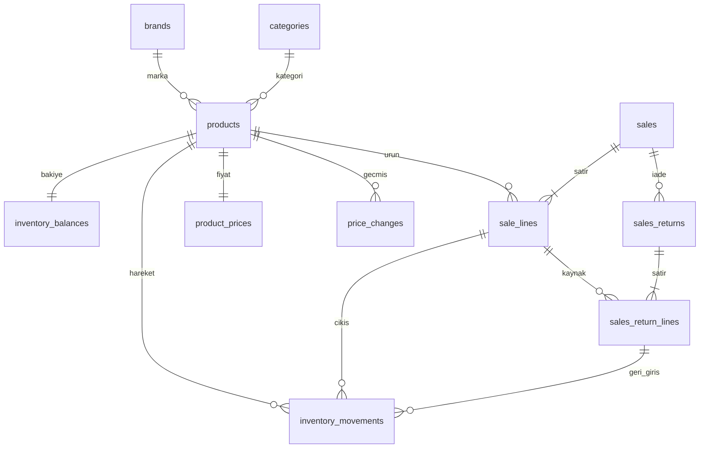

# GürBoya — PostgreSQL veritabanı taslağı

Durum: F2 ürün/stok ve kullanıcı şeması eklendi. F2 uygulanan model bölümü güncel kaynaktır; sonraki fazların ilişkisel modeli öneridir. İş kuralları ilgili fazdan önce netleştirilecek. F1-A yalnızca veritabanı altyapısını kurar; bu belgedeki bütün tabloları oluşturmaz.

## F2 uygulanan model

Bu bölüm F2 için geçerli uygulamayı tanımlar; aşağıdaki eski iş modeli tabloları sonraki fazlar için taslak olarak korunur.

- app.products: serbest metin marka/renk/kategori, isteğe bağlı benzersiz barkod, boya/tür, litre, BOX/PIECE/GRAM, alış/satış giriş fiyatı, KDV seçimi/oranı, aktiflik, stok bakiyesi ve version.
- app.stock_movements: append-only giriş/düzeltme/sayım hareketleri; işlem UUID, miktar farkı, gerekçe, işlem zamanı, kullanıcı ve o andaki KDV hariç alış fiyatı.
- app.price_changes: ilk fiyat ve her fiyat/KDV değişikliğinin snapshot'ı; önceki satırlar değişmez. Kart fiyatı geçmiş hareket maliyetini değiştirmez.
- app.operations: istek hash'i ve sonuç ürün kimliği; UUID üzerinde transaction advisory lock ile aynı isteğin tekrarı tek sonuç üretir, farklı içerikle tekrar reddedilir.
- ASP.NET Identity'nin app şemasındaki standart kullanıcı/claim/login/token tabloları: tek yonetici hesabı, güvenilir parola özeti ve kilitleme bilgisi; herkese açık kayıt uçları yok.

Stok tam sayıdır (bigint), gram hassasiyeti 1'dir; kesirli giriş sunucuda reddedilir. Ürün başına stok aralığı 0–1.000.000.000; miktar değiştiren tüm uygulama yolları tek transaction içinde ürün satırını FOR UPDATE kilitler. DB BEFORE INSERT hareket trigger'ı da satırı kilitleyip aktiflik/negatif stok kontrolünden sonra bakiyeyi ve version'ı günceller. Hata olursa hareket/bakiye/işlem kaydı birlikte rollback olur. Doğrudan bakiye güncelleme, geçmiş silme/değiştirme ve geçmişli ürünün birim/tür/litre değişimi DB seviyesinde engellenir. İşlem hesabının hareket/fiyat/istek geçmişi UPDATE/DELETE yetkileri kaldırılmıştır.

Sayım mutlak mevcut miktarı alır; kilit altındaki bakiyeden fark hesaplanır. Sıfır sayım ve aynı miktara sayım kaydı desteklenir. Yinelenen sayım, sonraki stok girişini geri almaz: aynı işlem kimliği eski sonucu döndürür. Pasif ürün geçmişi görünür fakat stok yazılamaz; kart yeniden aktif yapılabilir.

KDV: kullanıcı başlangıç oranını %15 seçti. KDV ekle: net=girilen fiyat, toplam=round4(net×(1+oran/100)), KDV=toplam−net. KDV dahil: toplam=girilen fiyat, net=round4(toplam/(1+oran/100)), KDV=toplam−net. Decimal hesap, dört ondalık basamak, MidpointRounding.AwayFromZero; arayüz en az iki/en fazla dört basamak gösterir. Ürün oranı değişebilir; eski fiyat kayıtlarının oranları korunur. Fiş toplamlarının iki basamaklı yuvarlaması F3 kapsamında ayrıca tasarlanır.

InitialInfrastructure korunur; InventoryAndOwner yeni kullanıcı/ürün/geçmiş tablolarını ve DB korumalarını, StockCount sayım kısıtlarını ekler. Boş veya mevcut F1-B DB açık migrate komutuyla yükseltilir; web açılışı şema değiştirmez. F1-B'deki app DML varsayılanları yeni tablolara uygulanır, geçmiş tablolarının yetkileri migration'da daraltılır.

## Tipler ve ortak kurallar

Öneri: Yerel tek işletme için PK bigint generated identity; dış isteğin tekrar kimliği UUID. Foreign key'ler geçmiş iş kayıtlarında ON DELETE RESTRICT. Katalogda is_active ile pasifleştirme; hareket/satışlarda soft delete yapılmaz. Para birimi başlangıç için TRY önerisi, onay bekliyor. Farklı para birimindeki toplamlar kur modeli olmadan birleştirilmez.

Miktar numeric(18,3), ambalaj litresi numeric(12,3), birim fiyat/maliyet numeric(18,4), para toplamları numeric(18,2) önerilir. Pozitif/negatif sınırlar alan amacına göre CHECK ile korunur. Adet ve kutu tam sayı olmalıdır. Bu eski taslaktaki 0,001 gram önerisi K15 ile değişti; uygulamada 1 gram hassasiyeti geçerlidir. Float/money yerine numeric; uygulama ve API'de eşdeğer kesin ondalık hesap/aktarımı gerekir. İzin verilen değerler sonlu olmalı, NaN/Infinity gibi özel numeric girdileri reddedilmelidir.

Olay zamanları timestamptz olarak saklanır; raporlar Europe/Istanbul iş günü sınırlarıyla hesaplanır. Oluşturulma ve işlem tarihi ayrı tutulur; geri tarihli işlem yetkisi/rapor etkisi kararlaştırılır. Audit zamanı sunucudan gelir. Katalog düzenlemesinde bigint version ile iyimser eşzamanlılık kontrolü önerilir; PostgreSQL'de MSSQL rowversion tipi varmış gibi tasarım yapılmaz.

## Katalog ve stok — F2 önerisi

| Tablo | Temel alanlar ve ilişkiler | Bütünlük / indeks |
|---|---|---|
| brands | id PK, name, normalized_name, is_active | normalized_name UNIQUE; boş ad reddi; Türkçe I/İ normalizasyonu açık tanımlanır |
| categories | id PK, name, normalized_name, is_active | normalized_name UNIQUE |
| products | id PK, sku, barcode nullable, name, brand_id FK nullable, category_id FK nullable, kind, stock_unit, package_liters nullable, is_active, version, created_at | sku UNIQUE; dolu barcode UNIQUE; kind/unit CHECK; boya için brand, pozitif package_liters ve BOX zorunlu önerisi |
| product_prices | product_id PK/FK, currency, purchase_price, sale_price, version, updated_at | Negatif fiyat yok; para birimi desteklenen liste; tek geçerli fiyat satırı |
| price_changes | id PK, product_id FK, eski/yeni alış ve satış fiyatı, currency, changed_at, actor_id FK, reason | (product_id, changed_at, id); sonradan güncellenmez |
| inventory_balances | product_id PK/FK, quantity, version | quantity >= 0 önerisi; ürün oluşturulurken 0 satırı açılır |
| inventory_movements | id PK, product_id FK, quantity_delta, kind, receipt_unit_cost nullable, currency nullable, sale_line_id FK nullable, return_line_id FK nullable, reversal_of_id FK nullable, operation_id FK, occurred_at, reason, actor_id FK | Delta sıfır olamaz; tür/kaynak/işaret tutarlılığı; (product_id, occurred_at, id), ilgili FK indeksleri |

Stock_unit BOX, PIECE veya GRAM; litre kutulu boyanın stok birimi değildir. Ürünün ambalaj hacmi/birim tanımı hareket oluşunca yerinde değiştirilmez; düzeltme gerekirse yeni ürün ve açıklamalı dönüşüm tasarlanır. Aynı marka/seri/hacimde farklı bazlar olabileceğinden bu üç alan üzerinde körlemesine UNIQUE kurulmaz; SKU kimliği kullanılır, muhtemel kopya giriş UI'da uyarılır.

Stok hareket türleri OPENING, RECEIPT, SALE, RETURN, ADJUSTMENT, REVERSAL önerilir. Giriş pozitif, satış negatif; düzeltme gerekçeli iki yönlü olabilir. Gerçek alış maliyeti her stok girişinde snapshot olarak tutulur; ürünün güncel alış fiyatı eski alış maliyetini değiştirmez. Tedarikçi/alış belgesi ilişkisi bu aşamada yoktur. Maliyet yöntemi (ağırlıklı ortalama/FIFO vb.) kararlaştırılmadan stok değeri veya brüt kâr doğruymuş gibi raporlanmaz.

Stok hareketlerinin toplamı tarihsel kaynaktır; inventory_balances hızlı erişim için aynı transaction içinde güncellenen izdüşümdür. Mutabakat testi her ürün için bakiye = hareket toplamını doğrular. Kutu/adet tam sayı kontrolü ürünün birimine bağlıdır; basit satır CHECK'i başka tabloyu okuyamaz. Ortak stok yazma rutini ve DB trigger/uygun tasarımla bütün yazma yollarında kontrol edilmelidir; seçimi migration öncesi netleşir.

## Satış ve düzeltme — F3 önerisi

| Tablo | Alanlar ve ilişkiler | Bütünlük / indeks |
|---|---|---|
| sales | id PK, number UNIQUE, operation_id UNIQUE FK, status, currency, gross_total, discount_total, tax_total, grand_total, occurred_at, actor_id FK | Tarih/id indeksi; durum ve tutar aralıkları; satış tahsilat anlamına gelmez |
| sale_lines | id PK, sale_id FK, line_no, product_id FK, quantity, unit_price, discount_amount, tax_rate, tax_amount, line_total, product_name_snapshot, unit_snapshot, package_liters_snapshot, color_code nullable | UNIQUE(sale_id,line_no); quantity > 0; product_id FK indeksi |
| sales_returns | id PK, sale_id FK, operation_id UNIQUE FK, kind, reason, occurred_at, actor_id FK | kind RETURN/CANCEL; iade toplamı kaynak satışla aynı para biriminde |
| sales_return_lines | id PK, return_id FK, sale_line_id FK, quantity, restock_quantity, refund_amount | quantity > 0; 0 <= restock_quantity <= quantity; (sale_line_id) indeksi |
| operations | id UUID PK, operation_type, request_hash, created_at | Aynı kimlik farklı içerikle gelirse conflict; iş kaydıyla aynı transaction |
| app_users | id PK, username, password_hash, is_active, role | Kimlik kütüphanesi/roller seçildikten sonra uyarlanır; düz metin şifre yok |
| audit_events | id PK, actor_id FK nullable, operation_id FK nullable, action, entity_type, entity_id, occurred_at, safe_changes | Zaman/entity indeksleri; sır/şifre yok; uygulama hesabı güncellemez/silmez |

Taslak satış durumu DRAFT ise stok etkisi yok; POSTED transaction tamamlanınca oluşur. İade/iptal ilk satış tutarlarını değiştirmez; net satış raporu iade belgelerini ayrıca düşer. İptal kalan iade edilmemiş miktar için ters belge oluşturur; ikinci iptal veya aşırı iade engellenir. İade edilen boya otomatik satılabilir sayılmaz: restock_quantity ayrı alandır, iş kuralı onay bekler. Hasarlı iade para iadesi doğurabilir ama satılabilir stoğu artırmamalıdır.

Vergi dahil/hariç, satır/fiş indirimi, yuvarlama ve kısmi iade kuruş dağıtımı henüz seçilmedi. Vergi alanları bu nedenle taslaktır; satış migration'ı öncesi örnek hesaplarla onay gerekir. İade tutarı güncel ürün fiyatından değil kaynak satırın dağıtılmış tutarından hesaplanır; toplam iadeler ilk tahsil edilebilir tutarı aşamaz. Son kısmi iade varsa kalan kuruş farkını kontrollü kapatmalıdır.

## Transaction ve eşzamanlılık algoritması

1. İstek kimliği ve içerik hash'i doğrulanır. operations kaydı ve sonuç ilişkisi aynı transaction içindedir. Aynı istek tekrarında aynı sonuç döner; rollback olmuş istek güvenle yeniden denenir.
2. Satıştaki aynı ürün miktarları birleştirilir; tüm ilgili inventory_balances satırları product_id sırasıyla SELECT FOR UPDATE ile kilitlenir. Başlangıç önerisi READ COMMITTED + açık satır kilididir.
3. Aktif ürün, birim hassasiyeti, fiyat sürümü ve stok kontrol edilir. Negatif stok engeli onaylanırsa yetersiz miktar tüm işlemi reddeder. Güncel fiyat kullanıcı ekranından sonra değiştiyse açık conflict gösterilir.
4. Satış ve fiyat/ürün snapshot'ları, negatif hareketler, stok bakiyeleri ve audit aynı transaction'da yazılır. Aynı satış satırının stok çıkışı kaynak UNIQUE kısıtıyla ikinci kez üretilemez.
5. Commit sonrası başarı yanıtı verilir. Bağlantı kopmasında aynı istek kimliğiyle sonuç sorgulanır. Deadlock/serialization hatasında sınırlı tekrar yapılır; kısmi işlem yeniden yürütülmez.
6. İadede kaynak satış satırları tutarlı sırada kilitlenir; önceki iade miktarı/toplamı hesaplanır, kalan sınır aşılmaz. Sonra stok kilitleri alınır; iade, varsa stok girişi ve audit birlikte kaydedilir. Tüm ilgili akışlar aynı kilit sırasını izler.

Kaynak linkli UNIQUE kısıtlar (satış satırı için satış hareketi, iade satırı için iade hareketi) kısmi indeksle uygulanabilir. İade satırının kendi belgesindeki satışa ait olması yalnızca iki bağımsız FK ile garanti olmaz; composite FK veya trigger ve işlem testleriyle korunmalıdır. Satış başlığının toplamı/satır toplamları ve stok defteri/bakiye ilişkisi de çapraz satır kurallarıdır; sadece CHECK yazmak yeterli değildir.

## İlişkiler

Kategori/marka genel ürünlerde opsiyoneldir; şema tabloları bunu belirtir. Diyagram ana akışın özetidir, nullability ve kısıtlarda tablo açıklaması esastır.

## Cari, ödeme ve gelecekte genişleme

Cari zorunluluğu bilinmiyor; şimdiden boş finans modülü oluşturulmaz. Gerekirse partners (müşteri/tedarikçi), account_entries (işaretli borç/alacak, kaynak belge, para birimi), payments (tahsilat/ödeme) ve payment_allocations (belgeye mahsup) birlikte tasarlanır. Bakiye hareketlerden türetilir; tahsilat, mahsup ve cari hareket aynı transaction'da olur; fazla mahsup, çift ödeme ve farklı para biriminin karışması engellenir. Ayrı belge olmadan bakiye elle üzerine yazılmaz. Bu tablolar henüz kesin şema değildir.

MVP'de tenant/şube tabloları yoktur. SaaS'a geçişte ayrı DB veya tenant_id yaklaşımı seçilecek; tüm ilişkiler, unique anahtarlar, erişim politikaları ve sızıntı testleri yeniden ele alınacaktır. Tenant sütunu eklemek tek başına izolasyon değildir. Şube eklenirse bakiye anahtarı ürün+lokasyon ve transferin çift hareketi gerekir; ilk sürüme erken eklenmez.

## Migration, yedek ve kabul

Şema sürümlenir; uygulama başlatıldığında kontrolsüz veri silme/otomatik reset yok. Migration aracı EF Core/dotnet-ef olarak seçildi. Kullanılmış migration değiştirilmez, yenisi eklenir. Üretim migration'ından önce test edilmiş yedek ve geri dönüş planı gerekir.

pg_dump custom format yedeği, pg_restore ile ayrı DB'ye prova önerilir. Rol/izin tanımları ayrıca tekrar kurulabilir olmalıdır; dump tek başına sunucu rollerini kapsamaz. Yedek sonucu ve geri yüklenen satır sayısı/örnek toplamlar doğrulanır. Günlük sıklık öneridir, kayıp hedefi ve harici saklama henüz onaylanmadı.

Kabul örnekleri: 12 kutu giriş−1 satış=11; aynı satış isteğinin tekrarında yine 11; son kutu için iki eşzamanlı satıştan yalnızca biri başarılı; işlem ortasında hata olursa satış/hareket/bakiye değişmez; fiyat 500'den 600'e çıkınca eski 500'lük satış korunur; 0,5 kutu reddedilir; onaylanan hassasiyette gram kabul edilir; satıştan fazla iade reddedilir; hasarlı iade satılabilir stoğu artırmaz; ürün pasifleştirilince geçmiş kayıt görünür; yedekten dönen bakiye hareket toplamını tutar. Bu testler henüz çalıştırılmadı.

Kaynaklar (8 Ekim 2026): [PostgreSQL satır kilitleri](https://www.postgresql.org/docs/current/explicit-locking.html), [yedek ve geri yükleme](https://www.postgresql.org/docs/current/backup-dump.html).

## F1-B uygulanan erişim ve migration altyapısı

- gurboya_admin: ilk PostgreSQL yönetimi ve hesap hazırlama; web'e verilmez.
- gurboya_migrator: superuser/CREATEDB/CREATEROLE olmayan, app ve infrastructure şemalarının sahibi; açık migration komutunda kullanılır.
- gurboya_app: CONNECT ve şema USAGE; migrator tarafından oluşturulacak app tablolarında DML, sequence kullanım yetkisi. Şema/DB oluşturamaz, geçici tablo oluşturamaz. infrastructure tablolarını yalnızca okuyabilir; EF geçmişini değiştiremez.

scripts/db/roles.sql transaction içinde roller ve izinleri hazırlar; mevcut volume üzerinde ayrıca çalıştırılabilir. Yeniden çalıştırma parola ayarlarını .env değerlerine getirir, veri/migration silmez. Bu işlem yalnızca projeye ait DB/rollerde kullanılmalıdır. Parola değişiminden sonra web konteynerini yeniden oluştur; .env değişikliği tek başına PostgreSQL parolasını değiştirmez.

İlk InitialInfrastructure migration'ı boş modelin sürümlü başlangıcıdır; yalnızca infrastructure.__EFMigrationsHistory kaydı oluşur. İş tablosu yoktur. Sonraki şema değişiklikleri yeni EF migration dosyalarıyla eklenir. Web hesabı normal açılışta geçmişi okuyup eksik migration varsa hazır olmadığını bildirir. Bakım hizmeti --migrate ile ayrı hesapta MigrateAsync çağırır; üretim bakımından önce incelenmiş migration ve doğrulanmış yedek gerekir.
